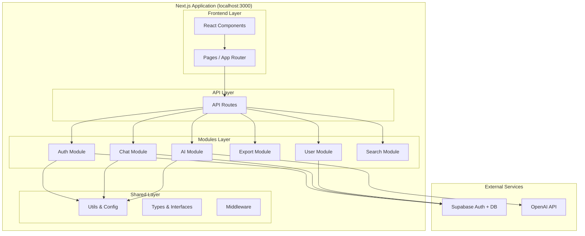

# ТЕХНИЧЕСКОЕ ЗАДАНИЕ
# Разработка модульного AI чат-бота на базе OpenAI GPT-4

**Версия документа:** 2.0.0
**Дата создания:** 23.10.2025
**Дата обновления:** 23.10.2025
**Статус:** Утверждено к разработке
**Тип проекта:** Учебный

---

## 📋 ОГЛАВЛЕНИЕ

1. [Общие положения](#1-общие-положения)
2. [Технологический стек](#2-технологический-стек)
3. [Архитектура системы](#3-архитектура-системы)
4. [Требования к безопасности](#4-требования-к-безопасности)
5. [Функциональные требования](#5-функциональные-требования)
6. [Структура проекта](#6-структура-проекта)
7. [База данных](#7-база-данных)
8. [API спецификация](#8-api-спецификация)
9. [План разработки](#9-план-разработки)
10. [Требования к документации](#10-требования-к-документации)
11. [Тестирование](#11-тестирование)
12. [Развертывание](#12-развертывание)
13. [Критерии приемки](#13-критерии-приемки)

---

## 1. ОБЩИЕ ПОЛОЖЕНИЯ

### 1.1. Назначение документа
Настоящее техническое задание (ТЗ) определяет требования к разработке учебного веб-приложения чат-бота с использованием искусственного интеллекта на базе OpenAI GPT-4. Документ является основным руководством для разработки и обучения.

### 1.2. Цель проекта
Создание **учебного** чат-приложения с AI-ассистентом для изучения современных технологий full-stack разработки. Проект отличается от стандартного ChatGPT следующими возможностями:

**🆕 Уникальные фичи:**
- **База чатов** - сохранение и организация истории всех диалогов
- **Экспорт чатов** - возможность скачивания в JSON, Markdown, TXT
- **Поиск по истории** - полнотекстовый поиск по всем сообщениям
- **Категоризация** - организация чатов по папкам и тегам

**🎓 Учебные цели:**
- Изучение модульной архитектуры (Modular Monolith)
- Работа с современным стеком (Next.js 14, TypeScript, Supabase)
- Интеграция с AI API (OpenAI GPT-4)
- Практика безопасной разработки

### 1.3. Ключевые принципы разработки
- **Modular First**: Модульная архитектура для изоляции кода и экономии токенов
- **Security First**: Безопасность на всех уровнях приложения
- **Localhost First**: Первая версия должна работать локально без деплоя
- **Documentation Driven**: Полная документация до начала кодирования
- **Environment Variables**: Все секретные данные только в переменных окружения
- **Clean Architecture**: Чистая архитектура и SOLID принципы внутри модулей
- **Test Coverage**: Минимум 70% покрытие тестами для учебного проекта

### 1.4. Ограничения и допущения
- ✅ **Сохранение истории** - все чаты сохраняются в БД (отличие от ChatGPT)
- ⚠️ Только текстовый ввод/вывод (без поддержки файлов и изображений в MVP)
- ⚠️ Авторизация только через GitHub OAuth (для упрощения)
- ✅ Использование готовых решений где возможно (Supabase, Radix UI)
- ✅ Разработка в модульном монолите (не микросервисы)
- ✅ Возможность локального запуска на localhost:3000

---

## 2. ТЕХНОЛОГИЧЕСКИЙ СТЕК

### 2.1. Frontend Technologies
```yaml
Framework:
  - Next.js: 14.2.31 (App Router)
  - React: 18.2.0
  - TypeScript: 5.1.3

Styling:
  - Tailwind CSS: 3.3.2
  - CSS Modules: для изолированных стилей

UI Components:
  - Radix UI: Headless компоненты
  - React Hot Toast: Уведомления
  - Framer Motion: Анимации (опционально)

State Management:
  - Zustand: Глобальное состояние
  - React Query (TanStack Query): Серверное состояние

Utilities:
  - axios: HTTP клиент
  - date-fns: Работа с датами
  - zod: Валидация схем
  - DOMPurify: Санитизация HTML
```

### 2.2. Backend Technologies
```yaml
Runtime:
  - Node.js: 20.x LTS
  - Edge Runtime: Для API routes (опционально)

Architecture:
  - Modular Monolith: Модули внутри Next.js приложения
  - Clean Architecture: Внутри каждого модуля

Database & Auth:
  - Supabase:
    - PostgreSQL: База данных
    - Row Level Security: Защита данных
    - GitHub OAuth: Авторизация
    - Realtime: WebSocket подключения (опционально)

AI Integration:
  - OpenAI API: GPT-4 модель
  - Streaming: Server-Sent Events для потоковых ответов

Optional (для production):
  - Upstash Redis: Rate limiting (free tier)
```

### 2.3. DevOps & Tools
```yaml
Development:
  - ESLint: Линтинг кода
  - Prettier: Форматирование
  - Husky: Git hooks (опционально)
  - tsx: TypeScript execution для скриптов

Testing:
  - Jest: Unit тесты
  - React Testing Library: Компонентные тесты
  - Playwright: E2E тесты (легче чем Cypress для учебного проекта)

Local Development:
  - npm run dev: Запуск на localhost:3000
  - Supabase Local: Локальная БД (опционально)

Deployment (опционально для MVP):
  - Vercel: Простой деплой с GitHub integration
  - Vercel Analytics: Базовая аналитика

Security:
  - Next.js Security Headers: Встроенная защита
  - Zod: Валидация входных данных
  - Supabase RLS: Row Level Security
```

---

## 3. АРХИТЕКТУРА СИСТЕМЫ

### 3.1. Обзор архитектуры (Modular Monolith)



**Ключевое отличие от микросервисов:**
- ✅ Всё работает в **одном процессе** Next.js (localhost:3000)
- ✅ Модули изолированы через **структуру папок и публичные API**
- ✅ Нет сетевых вызовов между модулями (быстрее)
- ✅ Один deployment, одна база кода
- ✅ Легко извлечь модуль в микросервис при необходимости

### 3.2. Описание модулей

#### 3.2.1. Auth Module (`src/modules/auth/`)
**Ответственность:** Аутентификация и авторизация пользователей

**Структура:**
```
auth/
├── api/           # API handlers
├── services/      # AuthService, SessionService
├── types/         # User, Session types
├── hooks/         # useAuth, useSession
└── index.ts       # Публичный API модуля
```

**Функции:**
- GitHub OAuth интеграция через Supabase
- Управление сессиями пользователей
- Middleware для защиты routes
- Logout и очистка сессий

**API Endpoints:**
```
POST /api/auth/login      # Инициация OAuth
GET  /api/auth/callback   # OAuth callback
POST /api/auth/logout
GET  /api/auth/session
```

**Публичный API:**
```typescript
export { AuthService } from './services/AuthService';
export { useAuth, useSession } from './hooks';
export type { User, Session } from './types';
```

---

#### 3.2.2. Chat Module (`src/modules/chat/`)
**Ответственность:** Управление чатами и сообщениями (🔥 **Ядро приложения**)

**Структура:**
```
chat/
├── api/           # CRUD операции для чатов
├── services/      # ChatService, MessageService
├── types/         # Chat, Message types
├── hooks/         # useChats, useChat
├── components/    # ChatList, ChatWindow, ChatMessage
├── store/         # Zustand store для чатов
└── index.ts
```

**Функции:**
- ✅ Создание/редактирование/удаление чатов
- ✅ Сохранение сообщений в БД (отличие от ChatGPT!)
- ✅ Автогенерация заголовков чатов
- ✅ Категоризация и теги
- ✅ История всех диалогов
- Валидация сообщений
- Подготовка контекста для AI

**API Endpoints:**
```
GET    /api/chats              # Список чатов пользователя
POST   /api/chats              # Создать чат
GET    /api/chats/[id]         # Получить чат
PUT    /api/chats/[id]         # Обновить (title, category, tags)
DELETE /api/chats/[id]         # Удалить чат
POST   /api/chats/[id]/messages # Отправить сообщение
GET    /api/chats/[id]/messages # История сообщений
```

---

#### 3.2.3. AI Module (`src/modules/ai/`)
**Ответственность:** Интеграция с OpenAI API

**Структура:**
```
ai/
├── api/           # Completion, streaming endpoints
├── services/      # OpenAIService, PromptService, StreamService
├── types/         # AIMessage, CompletionOptions
├── hooks/         # useAIStream
└── index.ts
```

**Функции:**
- Отправка запросов к GPT-4
- Server-Sent Events для streaming ответов
- Обработка ошибок API
- Token counting
- Промпт-инжиниринг

**API Endpoints:**
```
POST /api/ai/completion   # Обычный запрос
POST /api/ai/stream       # Streaming запрос (SSE)
```

---

#### 3.2.4. Export Module (`src/modules/export/`) 🆕
**Ответственность:** Экспорт чатов в файлы (уникальная фича!)

**Структура:**
```
export/
├── api/           # Export endpoint
├── services/      # ExportService, JSONExporter, MarkdownExporter, TextExporter
├── types/         # ExportFormat, ExportOptions
└── index.ts
```

**Функции:**
- ✅ Экспорт одного чата
- ✅ Экспорт всех чатов
- ✅ Форматы: JSON, Markdown, TXT
- Генерация download ссылок

**API Endpoints:**
```
GET /api/export/[chatId]?format=json|md|txt
GET /api/export/all?format=json
```

---

#### 3.2.5. Search Module (`src/modules/search/`) 🆕
**Ответственность:** Поиск по истории чатов

**Структура:**
```
search/
├── api/           # Search endpoint
├── services/      # SearchService (full-text search)
├── types/         # SearchQuery, SearchResult
├── components/    # SearchBar, SearchResults
└── index.ts
```

**Функции:**
- ✅ Полнотекстовый поиск по сообщениям
- ✅ Фильтрация по категориям/тегам
- Подсветка результатов

**API Endpoints:**
```
GET /api/search?q=typescript&category=study
```

---

#### 3.2.6. User Module (`src/modules/user/`)
**Ответственность:** Управление профилями и настройками

**Структура:**
```
user/
├── api/           # Profile, settings, stats
├── services/      # UserService, StatsService
├── types/         # UserProfile, Settings
├── hooks/         # useUser, useSettings
├── components/    # ProfileCard, SettingsPanel
└── index.ts
```

**Функции:**
- CRUD операции с профилями
- Управление настройками (тема, язык, модель AI)
- Статистика использования (опционально для MVP)

**API Endpoints:**
```
GET /api/users/profile
PUT /api/users/profile
GET /api/users/settings
PUT /api/users/settings
```

### 3.3. Взаимодействие модулей

#### Поток авторизации:
```
1. User clicks "Login with GitHub"
   ↓
2. Frontend → Auth Module API (/api/auth/login)
   ↓
3. Auth Module → Supabase Auth (OAuth redirect)
   ↓
4. GitHub OAuth → User authorizes → Callback
   ↓
5. Supabase Auth → Auth Module (/api/auth/callback)
   ↓
6. Auth Module creates session → Frontend
   ↓
7. Frontend saves session in cookies → Redirect to /chats
```

#### Поток отправки сообщения:
```
1. User types message in ChatInput
   ↓
2. Frontend → Chat Module API
   POST /api/chats/[id]/messages
   Body: { content: "Hello AI", role: "user" }
   ↓
3. Chat Module:
   - AuthService.getCurrentUser() ← Auth Module
   - MessageService.save(message) → Supabase DB
   ↓
4. Chat Module → AI Module
   AIService.getCompletion(messages[])
   ↓
5. AI Module → OpenAI API (GPT-4)
   Stream response via SSE
   ↓
6. AI Module streams chunks → Frontend
   data: {"chunk": "Hello"}
   data: {"chunk": " there"}
   data: {"done": true}
   ↓
7. Chat Module saves AI response → Supabase DB
   ↓
8. Frontend updates UI with complete message
```

#### Поток экспорта чата:
```
1. User clicks "Export as Markdown"
   ↓
2. Frontend → Export Module API
   GET /api/export/[chatId]?format=md
   ↓
3. Export Module:
   - ChatService.getChat(chatId) ← Chat Module
   - MarkdownExporter.export(chat)
   ↓
4. Export Module → Frontend
   Response: markdown file download
```

**Ключевые правила взаимодействия:**
- ✅ Модули общаются через публичные API (index.ts)
- ✅ Никаких прямых импортов внутренних файлов
- ✅ Зависимости: Auth → Chat → AI, Export, Search
- ✅ Изоляция: изменения в одном модуле не влияют на другие

---

## 4. ТРЕБОВАНИЯ К БЕЗОПАСНОСТИ

### 4.1. Аутентификация и авторизация

#### 4.1.1. OAuth 2.0 Flow
```typescript
// Конфигурация GitHub OAuth
const authConfig = {
  provider: 'github',
  scope: ['read:user', 'user:email'],
  redirectUrl: process.env.NEXT_PUBLIC_REDIRECT_URL,
  clientId: process.env.GITHUB_CLIENT_ID,
  clientSecret: process.env.GITHUB_CLIENT_SECRET // только на сервере
}
```

#### 4.1.2. JWT Token Structure
```typescript
interface JWTPayload {
  sub: string;          // user ID
  email: string;
  name: string;
  avatar_url?: string;
  iat: number;          // issued at
  exp: number;          // expiration (15 min)
  refresh_token: string; // для обновления
}
```

#### 4.1.3. Session Management
- Токены хранятся в httpOnly cookies
- Срок жизни access token: 15 минут
- Срок жизни refresh token: 7 дней
- Автоматическое обновление токенов
- Инвалидация при logout

### 4.2. Защита от основных видов атак

#### 4.2.1. XSS (Cross-Site Scripting)
```typescript
// Меры защиты:
1. Content Security Policy (CSP):
   "default-src 'self'; 
    script-src 'self' 'unsafe-inline' 'unsafe-eval'; 
    style-src 'self' 'unsafe-inline';
    img-src 'self' data: https:;
    connect-src 'self' https://api.openai.com https://*.supabase.co;"

2. Санитизация входных данных:
   import DOMPurify from 'dompurify';
   const clean = DOMPurify.sanitize(userInput);

3. Экранирование при выводе:
   - Использование React по умолчанию экранирует
   - Избегать dangerouslySetInnerHTML

4. HttpOnly cookies для токенов
```

#### 4.2.2. SQL Injection
```typescript
// Защита через Supabase:
1. Параметризованные запросы:
   const { data } = await supabase
     .from('messages')
     .select('*')
     .eq('user_id', userId) // автоматическая параметризация

2. Валидация типов с Zod:
   const messageSchema = z.object({
     content: z.string().max(10000),
     role: z.enum(['user', 'assistant'])
   });

3. Row Level Security (RLS) policies
```

#### 4.2.3. CSRF (Cross-Site Request Forgery)
```typescript
// Защитные меры:
1. CSRF токены для мутирующих операций
2. SameSite cookie attribute: 'strict'
3. Проверка Origin и Referer headers
4. Double Submit Cookie pattern
```

#### 4.2.4. Rate Limiting
```typescript
// Конфигурация rate limiter:
const rateLimitConfig = {
  windowMs: 15 * 60 * 1000,  // 15 минут
  max: 100,                   // максимум запросов
  message: 'Too many requests',
  standardHeaders: true,
  legacyHeaders: false,
  
  // Специальные лимиты:
  ai: {
    windowMs: 60 * 1000,      // 1 минута
    max: 10                   // 10 запросов к AI
  }
}
```

### 4.3. HTTP Security Headers
```javascript
// next.config.js
const securityHeaders = [
  {
    key: 'X-DNS-Prefetch-Control',
    value: 'on'
  },
  {
    key: 'Strict-Transport-Security',
    value: 'max-age=63072000; includeSubDomains; preload'
  },
  {
    key: 'X-Frame-Options',
    value: 'DENY'
  },
  {
    key: 'X-Content-Type-Options',
    value: 'nosniff'
  },
  {
    key: 'X-XSS-Protection',
    value: '1; mode=block'
  },
  {
    key: 'Referrer-Policy',
    value: 'strict-origin-when-cross-origin'
  },
  {
    key: 'Permissions-Policy',
    value: 'camera=(), microphone=(), geolocation=()'
  },
  {
    key: 'Content-Security-Policy',
    value: ContentSecurityPolicy
  }
];

module.exports = {
  async headers() {
    return [
      {
        source: '/:path*',
        headers: securityHeaders,
      },
    ]
  },
}
```

### 4.4. Валидация данных

#### 4.4.1. Input Validation Schema
```typescript
import { z } from 'zod';

// Схемы валидации
export const schemas = {
  // Авторизация
  loginSchema: z.object({
    email: z.string().email().max(255),
    password: z.string().min(6).max(100)
  }),

  // Сообщения
  messageSchema: z.object({
    content: z.string().min(1).max(10000),
    role: z.enum(['user', 'assistant', 'system'])
  }),

  // ID валидация
  uuidSchema: z.string().uuid(),
  
  // Настройки пользователя
  settingsSchema: z.object({
    theme: z.enum(['light', 'dark', 'system']),
    language: z.enum(['en', 'ru']),
    model: z.enum(['gpt-4', 'gpt-3.5-turbo'])
  })
};

// Middleware для валидации
export const validateRequest = (schema: ZodSchema) => {
  return async (req: Request) => {
    try {
      const body = await req.json();
      return schema.parse(body);
    } catch (error) {
      throw new ValidationError(error);
    }
  };
};
```

#### 4.4.2. Output Sanitization
```typescript
// Санитизация ответов от AI
export const sanitizeAIResponse = (response: string): string => {
  // Удаление потенциально опасного контента
  const cleaned = DOMPurify.sanitize(response, {
    ALLOWED_TAGS: ['p', 'br', 'strong', 'em', 'code', 'pre'],
    ALLOWED_ATTR: []
  });
  
  // Дополнительная проверка на инъекции
  const injectionPatterns = [
    /<script/gi,
    /javascript:/gi,
    /on\w+=/gi
  ];
  
  for (const pattern of injectionPatterns) {
    if (pattern.test(cleaned)) {
      throw new SecurityError('Potential injection detected');
    }
  }
  
  return cleaned;
};
```

### 4.5. Управление секретами

#### 4.5.1. Environment Variables Structure
```bash
# .env.local (НЕ коммитить в репозиторий!)

# Supabase
NEXT_PUBLIC_SUPABASE_URL=https://xxx.supabase.co
NEXT_PUBLIC_SUPABASE_ANON_KEY=xxx
SUPABASE_SERVICE_ROLE_KEY=xxx

# OpenAI
OPENAI_API_KEY=sk-xxx
OPENAI_ORG_ID=org-xxx

# GitHub OAuth
GITHUB_CLIENT_ID=xxx
GITHUB_CLIENT_SECRET=xxx

# Security
JWT_SECRET=xxx # Минимум 32 символа
ENCRYPTION_KEY=xxx # Для шифрования sensitive данных
CSRF_SECRET=xxx

# Application
NEXT_PUBLIC_APP_URL=http://localhost:3000

# Redis (опционально для rate limiting)
REDIS_URL=redis://localhost:6379
REDIS_PASSWORD=xxx

# Monitoring (опционально для production)
SENTRY_DSN=https://xxx@sentry.io/xxx
NEXT_PUBLIC_SENTRY_DSN=https://xxx@sentry.io/xxx
```

#### 4.5.2. Secrets Management Best Practices
```yaml
Development:
  - Использовать .env.local
  - Добавить .env* в .gitignore
  - Предоставить .env.example с заглушками

Staging/Production:
  - Использовать секреты платформы (Vercel Env Variables)
  - Ротация ключей каждые 90 дней
  - Аудит доступа к секретам
  - Шифрование в покое

CI/CD:
  - GitHub Secrets для Actions
  - Ограниченный доступ к секретам
  - Маскирование в логах
```

---

## 5. ФУНКЦИОНАЛЬНЫЕ ТРЕБОВАНИЯ

### 5.1. Пользовательские истории (User Stories)

#### 5.1.1. Авторизация
```gherkin
Feature: Авторизация через GitHub

Scenario: Успешный вход
  Given Я нахожусь на странице входа
  When Я нажимаю "Войти через GitHub"
  And Я авторизуюсь в GitHub
  Then Я перенаправлен на главную страницу чата
  And Я вижу свое имя пользователя

Scenario: Отказ в авторизации
  Given Я нахожусь на странице входа
  When Я нажимаю "Войти через GitHub"
  And Я отменяю авторизацию
  Then Я остаюсь на странице входа
  And Вижу сообщение "Авторизация отменена"
```

#### 5.1.2. Чат с AI
```gherkin
Feature: Общение с AI

Scenario: Отправка сообщения
  Given Я авторизован
  And Я нахожусь на странице чата
  When Я ввожу "Привет, как дела?"
  And Нажимаю Enter или кнопку отправки
  Then Сообщение появляется в чате
  And Появляется индикатор "AI печатает..."
  And Я получаю ответ от AI

Scenario: Лимит сообщений
  Given У меня достигнут лимит сообщений
  When Я пытаюсь отправить сообщение
  Then Вижу уведомление о лимите
  And Поле ввода заблокировано
```

### 5.2. Функциональные модули

#### 5.2.1. Модуль авторизации
| Функция | Описание | Приоритет |
|---------|----------|-----------|
| GitHub OAuth | Вход через GitHub аккаунт | Высокий |
| Сессии | Поддержка сессий 7 дней | Высокий |
| Logout | Выход и очистка сессии | Высокий |
| Auto-refresh | Автообновление токенов | Средний |
| Remember me | Запомнить пользователя | Низкий |

#### 5.2.2. Модуль чата (🆕 с историей)
| Функция | Описание | Приоритет |
|---------|----------|-----------|
| **Создание чатов** | Новый диалог с AI | **Высокий** |
| **Список чатов** | История всех диалогов (отличие от ChatGPT!) | **Высокий** |
| Отправка сообщений | Текстовые сообщения до 10000 символов | Высокий |
| Получение ответов | Streaming ответы от AI | Высокий |
| **Автогенерация заголовков** | AI создаёт название чата | **Средний** |
| Индикатор печати | Показ процесса генерации | Высокий |
| Остановка генерации | Кнопка остановки ответа | Средний |
| Копирование | Копировать сообщение | Средний |
| Удаление чата | Удалить конкретный чат | Средний |
| **Категории/теги** | Организация чатов | **Средний** |
| Счетчик символов | Показ оставшихся символов | Низкий |

#### 5.2.3. Модуль экспорта (🆕 уникальная фича)
| Функция | Описание | Приоритет |
|---------|----------|-----------|
| **Экспорт JSON** | Скачать чат в JSON | **Высокий** |
| **Экспорт Markdown** | Скачать чат в Markdown | **Высокий** |
| **Экспорт TXT** | Скачать чат в текстовом формате | Средний |
| Экспорт всех чатов | Архив всех диалогов | Низкий |

#### 5.2.4. Модуль поиска (🆕 уникальная фича)
| Функция | Описание | Приоритет |
|---------|----------|-----------|
| **Полнотекстовый поиск** | Поиск по всем сообщениям | **Средний** |
| Фильтр по категориям | Поиск внутри категории | Средний |
| Подсветка результатов | Highlight найденного текста | Низкий |

#### 5.2.5. Модуль настроек
| Функция | Описание | Приоритет |
|---------|----------|-----------|
| Темная тема | Переключение темы | Средний |
| Язык интерфейса | EN/RU (опционально) | Низкий |
| Модель AI | Выбор GPT модели | Низкий |

### 5.3. Нефункциональные требования (упрощённые для учебного проекта)

#### 5.3.1. Производительность
```yaml
Целевые метрики (для localhost):
  - First Contentful Paint (FCP): < 2s
  - Time to Interactive (TTI): < 4s
  - API Response Time: < 1s (без AI)
  - AI Response Start: < 3s
  - Concurrent Users: 10-20 (локальная разработка)

Оптимизации:
  - React компоненты с memo
  - Lazy loading для больших компонентов
  - Pagination для списка чатов (>100 элементов)
```

#### 5.3.2. Надежность
```yaml
Требования для учебного проекта:
  - Graceful error handling (красивые сообщения об ошибках)
  - Loading states для всех async операций
  - Retry механизм для OpenAI API (1 retry)
  - Fallback UI при недоступности сервисов
```

#### 5.3.3. Масштабируемость
```yaml
Архитектурные решения для будущего масштабирования:
  - Модульная архитектура (легко извлечь в микросервисы)
  - Database connection pooling (Supabase автоматически)
  - Stateless API routes (готовность к горизонтальному масштабированию)

Примечание: Для MVP масштабируемость не критична
```

#### 5.3.4. Совместимость
```yaml
Браузеры:
  - Chrome 90+
  - Firefox 88+
  - Safari 14+
  - Edge 90+
  
Устройства:
  - Desktop: 1280px+
  - Tablet: 768px - 1279px
  - Mobile: 320px - 767px
  
Доступность:
  - WCAG 2.1 Level AA
  - Keyboard navigation
  - Screen reader support
```

---

## 6. СТРУКТУРА ПРОЕКТА

### 6.1. Монорепозиторий структура

```
ai-chatbot/
├── apps/
│   ├── web/                          # Next.js Frontend
│   │   ├── app/                      # App Router
│   │   │   ├── (auth)/              # Auth группа
│   │   │   │   ├── login/
│   │   │   │   └── logout/
│   │   │   ├── (chat)/              # Chat группа
│   │   │   │   └── page.tsx
│   │   │   ├── api/                 # API Routes
│   │   │   │   ├── auth/
│   │   │   │   ├── chat/
│   │   │   │   └── ai/
│   │   │   ├── layout.tsx
│   │   │   └── globals.css
│   │   ├── components/              # React компоненты
│   │   │   ├── chat/
│   │   │   │   ├── ChatInput.tsx
│   │   │   │   ├── ChatMessage.tsx
│   │   │   │   └── ChatWindow.tsx
│   │   │   ├── ui/                  # Базовые UI компоненты
│   │   │   │   ├── Button.tsx
│   │   │   │   ├── Input.tsx
│   │   │   │   └── Card.tsx
│   │   │   └── layout/
│   │   │       ├── Header.tsx
│   │   │       └── Footer.tsx
│   │   ├── lib/                     # Утилиты и хелперы
│   │   │   ├── api/
│   │   │   ├── utils/
│   │   │   └── constants/
│   │   ├── hooks/                   # Custom hooks
│   │   │   ├── useAuth.ts
│   │   │   └── useChat.ts
│   │   ├── store/                   # Zustand store
│   │   │   └── chat.store.ts
│   │   ├── styles/                  # Дополнительные стили
│   │   ├── public/                  # Статические файлы
│   │   ├── middleware.ts            # Next.js middleware
│   │   ├── next.config.js
│   │   ├── tailwind.config.js
│   │   ├── tsconfig.json
│   │   └── package.json
│   │
│   ├── auth-service/                # Auth микросервис
│   │   ├── src/
│   │   │   ├── controllers/
│   │   │   ├── services/
│   │   │   ├── middleware/
│   │   │   ├── routes/
│   │   │   ├── utils/
│   │   │   └── index.ts
│   │   ├── tests/
│   │   ├── Dockerfile
│   │   ├── tsconfig.json
│   │   └── package.json
│   │
│   ├── chat-service/                # Chat микросервис
│   │   ├── src/
│   │   │   ├── controllers/
│   │   │   ├── services/
│   │   │   ├── middleware/
│   │   │   ├── routes/
│   │   │   └── index.ts
│   │   ├── tests/
│   │   ├── Dockerfile
│   │   └── package.json
│   │
│   ├── ai-service/                  # AI микросервис
│   │   ├── src/
│   │   │   ├── controllers/
│   │   │   ├── services/
│   │   │   │   ├── openai.service.ts
│   │   │   │   └── prompt.service.ts
│   │   │   ├── middleware/
│   │   │   ├── routes/
│   │   │   └── index.ts
│   │   ├── tests/
│   │   ├── Dockerfile
│   │   └── package.json
│   │
│   └── user-service/                # User микросервис
│       ├── src/
│       ├── tests/
│       ├── Dockerfile
│       └── package.json
│
├── packages/                        # Shared packages
│   ├── shared/                     # Общие утилиты
│   │   ├── src/
│   │   │   ├── types/
│   │   │   ├── utils/
│   │   │   └── constants/
│   │   └── package.json
│   │
│   ├── ui/                         # Shared UI компоненты
│   │   ├── src/
│   │   │   └── components/
│   │   └── package.json
│   │
│   ├── database/                   # Database схемы и миграции
│   │   ├── migrations/
│   │   ├── seeds/
│   │   └── schema.sql
│   │
│   └── config/                     # Конфигурации
│       ├── eslint-config/
│       ├── typescript-config/
│       └── tailwind-config/
│
├── docs/                           # Документация
│   ├── API.md                     # API документация
│   ├── ARCHITECTURE.md            # Архитектура
│   ├── SECURITY.md                # Безопасность
│   ├── DEPLOYMENT.md              # Развертывание
│   ├── CONTRIBUTING.md            # Для разработчиков
│   └── diagrams/                  # Диаграммы
│
├── scripts/                        # Скрипты
│   ├── setup.sh                   # Начальная настройка
│   ├── dev.sh                     # Запуск разработки
│   ├── build.sh                   # Сборка проекта
│   ├── test.sh                    # Запуск тестов
│   └── deploy.sh                  # Деплой
│
├── .github/                        # GitHub конфигурация
│   ├── workflows/
│   │   ├── ci.yml                # Continuous Integration
│   │   ├── cd.yml                # Continuous Deployment
│   │   └── security.yml          # Security checks
│   ├── ISSUE_TEMPLATE/
│   └── PULL_REQUEST_TEMPLATE.md
│
├── .docker/                        # Docker файлы
│   ├── nginx/
│   │   └── nginx.conf
│   └── redis/
│       └── redis.conf
│
├── tests/                          # E2E тесты
│   ├── e2e/
│   └── integration/
│
├── .vscode/                        # VS Code настройки
│   ├── settings.json
│   ├── launch.json
│   └── extensions.json
│
├── docker-compose.yml              # Docker Compose для разработки
├── docker-compose.prod.yml         # Docker Compose для продакшена
├── .env.example                    # Пример переменных окружения
├── .gitignore                      # Git ignore файл
├── .prettierrc                     # Prettier конфигурация
├── .eslintrc.js                    # ESLint конфигурация
├── jest.config.js                  # Jest конфигурация
├── turbo.json                      # Turborepo конфигурация
├── package.json                    # Root package.json
├── pnpm-workspace.yaml             # PNPM workspace
├── TODO.md                         # Список задач
├── CHANGELOG.md                    # История изменений
├── LICENSE                         # Лицензия
└── README.md                       # Главный README
```

### 6.2. Конфигурационные файлы

#### 6.2.1. Root package.json
```json
{
  "name": "ai-chatbot",
  "version": "1.0.0",
  "private": true,
  "workspaces": [
    "apps/*",
    "packages/*"
  ],
  "scripts": {
    "dev": "turbo run dev",
    "build": "turbo run build",
    "test": "turbo run test",
    "lint": "turbo run lint",
    "format": "prettier --write \"**/*.{ts,tsx,md}\"",
    "prepare": "husky install"
  },
  "devDependencies": {
    "turbo": "latest",
    "prettier": "latest",
    "husky": "latest",
    "@commitlint/cli": "latest",
    "@commitlint/config-conventional": "latest"
  },
  "engines": {
    "node": ">=20.0.0",
    "pnpm": ">=8.0.0"
  }
}
```

#### 6.2.2. docker-compose.yml
```yaml
version: '3.9'

services:
  # Frontend
  web:
    build: ./apps/web
    ports:
      - "3000:3000"
    environment:
      - NODE_ENV=development
    env_file:
      - .env.local
    volumes:
      - ./apps/web:/app
      - /app/node_modules
    depends_on:
      - auth-service
      - chat-service
      - ai-service
      - user-service

  # Microservices
  auth-service:
    build: ./apps/auth-service
    ports:
      - "3001:3001"
    environment:
      - NODE_ENV=development
    env_file:
      - .env.local
    volumes:
      - ./apps/auth-service:/app
      - /app/node_modules

  chat-service:
    build: ./apps/chat-service
    ports:
      - "3002:3002"
    environment:
      - NODE_ENV=development
    env_file:
      - .env.local
    volumes:
      - ./apps/chat-service:/app
      - /app/node_modules
    depends_on:
      - redis

  ai-service:
    build: ./apps/ai-service
    ports:
      - "3003:3003"
    environment:
      - NODE_ENV=development
    env_file:
      - .env.local
    volumes:
      - ./apps/ai-service:/app
      - /app/node_modules
    depends_on:
      - redis

  user-service:
    build: ./apps/user-service
    ports:
      - "3004:3004"
    environment:
      - NODE_ENV=development
    env_file:
      - .env.local
    volumes:
      - ./apps/user-service:/app
      - /app/node_modules

  # Redis cache
  redis:
    image: redis:7-alpine
    ports:
      - "6379:6379"
    volumes:
      - redis_data:/data
    command: redis-server --appendonly yes

  # Nginx (optional for production-like env)
  nginx:
    image: nginx:alpine
    ports:
      - "80:80"
    volumes:
      - ./.docker/nginx/nginx.conf:/etc/nginx/nginx.conf:ro
    depends_on:
      - web

volumes:
  redis_data:
```

---

## 7. БАЗА ДАННЫХ

### 7.1. Схема базы данных

```sql
-- Enable UUID extension
CREATE EXTENSION IF NOT EXISTS "uuid-ossp";

-- Users table (managed by Supabase Auth)
-- Расширяем стандартную таблицу auth.users

-- User profiles table
CREATE TABLE public.profiles (
  id UUID PRIMARY KEY REFERENCES auth.users(id) ON DELETE CASCADE,
  username VARCHAR(50) UNIQUE,
  full_name VARCHAR(100),
  avatar_url TEXT,
  github_username VARCHAR(50),
  settings JSONB DEFAULT '{}',
  created_at TIMESTAMPTZ DEFAULT NOW(),
  updated_at TIMESTAMPTZ DEFAULT NOW()
);

-- User sessions (для отслеживания активных сессий)
CREATE TABLE public.sessions (
  id UUID PRIMARY KEY DEFAULT uuid_generate_v4(),
  user_id UUID NOT NULL REFERENCES public.profiles(id) ON DELETE CASCADE,
  token_hash VARCHAR(255) NOT NULL UNIQUE,
  ip_address INET,
  user_agent TEXT,
  expires_at TIMESTAMPTZ NOT NULL,
  created_at TIMESTAMPTZ DEFAULT NOW(),
  last_activity TIMESTAMPTZ DEFAULT NOW(),
  
  INDEX idx_sessions_user_id (user_id),
  INDEX idx_sessions_token (token_hash),
  INDEX idx_sessions_expires (expires_at)
);

-- Chat messages (временное хранение для аналитики)
CREATE TABLE public.chat_messages (
  id UUID PRIMARY KEY DEFAULT uuid_generate_v4(),
  user_id UUID NOT NULL REFERENCES public.profiles(id) ON DELETE CASCADE,
  role VARCHAR(20) NOT NULL CHECK (role IN ('user', 'assistant', 'system')),
  content TEXT NOT NULL,
  tokens_used INTEGER,
  model VARCHAR(50),
  created_at TIMESTAMPTZ DEFAULT NOW(),
  
  INDEX idx_messages_user_id (user_id),
  INDEX idx_messages_created (created_at)
);

-- Usage statistics
CREATE TABLE public.usage_stats (
  id UUID PRIMARY KEY DEFAULT uuid_generate_v4(),
  user_id UUID NOT NULL REFERENCES public.profiles(id) ON DELETE CASCADE,
  date DATE NOT NULL,
  messages_count INTEGER DEFAULT 0,
  tokens_used INTEGER DEFAULT 0,
  ai_requests_count INTEGER DEFAULT 0,
  created_at TIMESTAMPTZ DEFAULT NOW(),
  updated_at TIMESTAMPTZ DEFAULT NOW(),
  
  UNIQUE(user_id, date),
  INDEX idx_usage_user_date (user_id, date)
);

-- Rate limiting
CREATE TABLE public.rate_limits (
  id UUID PRIMARY KEY DEFAULT uuid_generate_v4(),
  user_id UUID NOT NULL REFERENCES public.profiles(id) ON DELETE CASCADE,
  endpoint VARCHAR(100) NOT NULL,
  requests_count INTEGER DEFAULT 0,
  window_start TIMESTAMPTZ NOT NULL,
  window_end TIMESTAMPTZ NOT NULL,
  
  UNIQUE(user_id, endpoint, window_start),
  INDEX idx_rate_limits_user_endpoint (user_id, endpoint),
  INDEX idx_rate_limits_window (window_end)
);

-- Audit logs
CREATE TABLE public.audit_logs (
  id UUID PRIMARY KEY DEFAULT uuid_generate_v4(),
  user_id UUID REFERENCES public.profiles(id) ON DELETE SET NULL,
  action VARCHAR(100) NOT NULL,
  entity_type VARCHAR(50),
  entity_id UUID,
  changes JSONB,
  ip_address INET,
  user_agent TEXT,
  created_at TIMESTAMPTZ DEFAULT NOW(),
  
  INDEX idx_audit_user_id (user_id),
  INDEX idx_audit_action (action),
  INDEX idx_audit_created (created_at)
);
```

### 7.2. Row Level Security (RLS) Policies

```sql
-- Enable RLS
ALTER TABLE public.profiles ENABLE ROW LEVEL SECURITY;
ALTER TABLE public.sessions ENABLE ROW LEVEL SECURITY;
ALTER TABLE public.chat_messages ENABLE ROW LEVEL SECURITY;
ALTER TABLE public.usage_stats ENABLE ROW LEVEL SECURITY;
ALTER TABLE public.rate_limits ENABLE ROW LEVEL SECURITY;
ALTER TABLE public.audit_logs ENABLE ROW LEVEL SECURITY;

-- Profiles policies
CREATE POLICY "Users can view own profile" 
  ON public.profiles FOR SELECT 
  USING (auth.uid() = id);

CREATE POLICY "Users can update own profile" 
  ON public.profiles FOR UPDATE 
  USING (auth.uid() = id);

-- Sessions policies
CREATE POLICY "Users can view own sessions" 
  ON public.sessions FOR SELECT 
  USING (auth.uid() = user_id);

CREATE POLICY "Users can delete own sessions" 
  ON public.sessions FOR DELETE 
  USING (auth.uid() = user_id);

-- Chat messages policies
CREATE POLICY "Users can view own messages" 
  ON public.chat_messages FOR SELECT 
  USING (auth.uid() = user_id);

CREATE POLICY "Users can insert own messages" 
  ON public.chat_messages FOR INSERT 
  WITH CHECK (auth.uid() = user_id);

CREATE POLICY "Users can delete own messages" 
  ON public.chat_messages FOR DELETE 
  USING (auth.uid() = user_id);

-- Usage stats policies
CREATE POLICY "Users can view own stats" 
  ON public.usage_stats FOR SELECT 
  USING (auth.uid() = user_id);

-- Rate limits policies  
CREATE POLICY "Users can view own rate limits" 
  ON public.rate_limits FOR SELECT 
  USING (auth.uid() = user_id);

-- Audit logs policies (read-only for users)
CREATE POLICY "Users can view own audit logs" 
  ON public.audit_logs FOR SELECT 
  USING (auth.uid() = user_id);
```

### 7.3. Database Functions и Triggers

```sql
-- Function для обновления updated_at
CREATE OR REPLACE FUNCTION update_updated_at_column()
RETURNS TRIGGER AS $$
BEGIN
  NEW.updated_at = NOW();
  RETURN NEW;
END;
$$ language 'plpgsql';

-- Triggers для updated_at
CREATE TRIGGER update_profiles_updated_at 
  BEFORE UPDATE ON public.profiles 
  FOR EACH ROW 
  EXECUTE FUNCTION update_updated_at_column();

CREATE TRIGGER update_usage_stats_updated_at 
  BEFORE UPDATE ON public.usage_stats 
  FOR EACH ROW 
  EXECUTE FUNCTION update_updated_at_column();

-- Function для автоматической очистки старых сессий
CREATE OR REPLACE FUNCTION cleanup_expired_sessions()
RETURNS void AS $$
BEGIN
  DELETE FROM public.sessions 
  WHERE expires_at < NOW();
END;
$$ language 'plpgsql';

-- Function для подсчета использования
CREATE OR REPLACE FUNCTION increment_usage_stats(
  p_user_id UUID,
  p_tokens INTEGER,
  p_is_ai_request BOOLEAN DEFAULT FALSE
)
RETURNS void AS $$
BEGIN
  INSERT INTO public.usage_stats (user_id, date, messages_count, tokens_used, ai_requests_count)
  VALUES (
    p_user_id, 
    CURRENT_DATE, 
    1, 
    p_tokens,
    CASE WHEN p_is_ai_request THEN 1 ELSE 0 END
  )
  ON CONFLICT (user_id, date) DO UPDATE
  SET 
    messages_count = usage_stats.messages_count + 1,
    tokens_used = usage_stats.tokens_used + p_tokens,
    ai_requests_count = usage_stats.ai_requests_count + 
      CASE WHEN p_is_ai_request THEN 1 ELSE 0 END;
END;
$$ language 'plpgsql';
```

---

## 8. API СПЕЦИФИКАЦИЯ

### 8.1. RESTful API Endpoints

#### 8.1.1. Authentication Service API

```typescript
/**
 * POST /api/auth/login
 * Инициирует OAuth flow
 */
interface LoginRequest {
  provider: 'github';
  redirectUrl?: string;
}

interface LoginResponse {
  authUrl: string;
}

/**
 * POST /api/auth/callback
 * Обработка OAuth callback
 */
interface CallbackRequest {
  code: string;
  state: string;
}

interface CallbackResponse {
  user: {
    id: string;
    email: string;
    name: string;
    avatar_url?: string;
  };
  session: {
    access_token: string;
    refresh_token: string;
    expires_in: number;
  };
}

/**
 * POST /api/auth/refresh
 * Обновление токена
 */
interface RefreshRequest {
  refresh_token: string;
}

interface RefreshResponse {
  access_token: string;
  expires_in: number;
}

/**
 * POST /api/auth/logout
 * Выход из системы
 */
interface LogoutRequest {
  everywhere?: boolean; // Выйти на всех устройствах
}

/**
 * GET /api/auth/session
 * Получение текущей сессии
 */
interface SessionResponse {
  user: {
    id: string;
    email: string;
    name: string;
    avatar_url?: string;
  } | null;
  expires_at?: string;
}
```

#### 8.1.2. Chat Service API

```typescript
/**
 * POST /api/chat/message
 * Отправка сообщения
 */
interface SendMessageRequest {
  content: string;
  context?: Message[]; // Предыдущие сообщения для контекста
}

interface Message {
  role: 'user' | 'assistant' | 'system';
  content: string;
  timestamp?: string;
}

interface SendMessageResponse {
  id: string;
  role: 'assistant';
  content: string;
  tokens_used: number;
  model: string;
  created_at: string;
}

/**
 * GET /api/chat/history
 * Получение истории текущей сессии
 */
interface HistoryResponse {
  messages: Message[];
  total_tokens: number;
}

/**
 * DELETE /api/chat/clear
 * Очистка истории чата
 */
interface ClearChatResponse {
  success: boolean;
  message: string;
}

/**
 * POST /api/chat/export
 * Экспорт истории чата
 */
interface ExportRequest {
  format: 'json' | 'txt' | 'md';
}

interface ExportResponse {
  download_url: string;
  expires_at: string;
}
```

#### 8.1.3. AI Service API

```typescript
/**
 * POST /api/ai/completion
 * Получение ответа от AI
 */
interface CompletionRequest {
  messages: Message[];
  model?: 'gpt-4' | 'gpt-3.5-turbo';
  temperature?: number; // 0-2, default 0.7
  max_tokens?: number; // default 2000
  stream?: boolean; // default true
}

interface CompletionResponse {
  id: string;
  content: string;
  model: string;
  tokens: {
    prompt: number;
    completion: number;
    total: number;
  };
  created_at: string;
}

/**
 * POST /api/ai/stream
 * Server-Sent Events для streaming
 */
// Event stream format:
// data: {"chunk": "Hello", "id": "msg-123"}
// data: {"chunk": " world", "id": "msg-123"}
// data: {"done": true, "tokens": {...}}

/**
 * GET /api/ai/models
 * Список доступных моделей
 */
interface ModelsResponse {
  models: Array<{
    id: string;
    name: string;
    max_tokens: number;
    available: boolean;
  }>;
}

/**
 * POST /api/ai/validate-prompt
 * Валидация промпта перед отправкой
 */
interface ValidatePromptRequest {
  content: string;
}

interface ValidatePromptResponse {
  valid: boolean;
  issues?: string[];
  estimated_tokens: number;
}
```

#### 8.1.4. User Service API

```typescript
/**
 * GET /api/users/profile
 * Получение профиля
 */
interface ProfileResponse {
  id: string;
  username?: string;
  full_name?: string;
  email: string;
  avatar_url?: string;
  github_username?: string;
  settings: UserSettings;
  created_at: string;
}

/**
 * PUT /api/users/profile
 * Обновление профиля
 */
interface UpdateProfileRequest {
  username?: string;
  full_name?: string;
  avatar_url?: string;
}

/**
 * GET /api/users/settings
 * Получение настроек
 */
interface UserSettings {
  theme: 'light' | 'dark' | 'system';
  language: 'en' | 'ru';
  model: 'gpt-4' | 'gpt-3.5-turbo';
  notifications: boolean;
}

/**
 * PUT /api/users/settings
 * Обновление настроек
 */
interface UpdateSettingsRequest extends Partial<UserSettings> {}

/**
 * GET /api/users/stats
 * Статистика использования
 */
interface StatsResponse {
  usage: {
    messages_today: number;
    messages_total: number;
    tokens_today: number;
    tokens_total: number;
  };
  limits: {
    messages_per_day: number;
    tokens_per_day: number;
    remaining_messages: number;
    remaining_tokens: number;
    resets_at: string;
  };
}
```

### 8.2. Обработка ошибок

```typescript
interface ErrorResponse {
  error: {
    code: string;
    message: string;
    details?: any;
    timestamp: string;
    path: string;
  };
}

// Коды ошибок
enum ErrorCodes {
  // Auth errors (4xx)
  UNAUTHORIZED = 'AUTH001',
  INVALID_TOKEN = 'AUTH002',
  TOKEN_EXPIRED = 'AUTH003',
  INSUFFICIENT_PERMISSIONS = 'AUTH004',
  
  // Validation errors (4xx)
  VALIDATION_ERROR = 'VAL001',
  INVALID_INPUT = 'VAL002',
  MESSAGE_TOO_LONG = 'VAL003',
  
  // Rate limit errors (429)
  RATE_LIMIT_EXCEEDED = 'RATE001',
  QUOTA_EXCEEDED = 'RATE002',
  
  // AI errors (5xx)
  AI_SERVICE_ERROR = 'AI001',
  AI_SERVICE_UNAVAILABLE = 'AI002',
  AI_RESPONSE_ERROR = 'AI003',
  
  // Server errors (5xx)
  INTERNAL_ERROR = 'SRV001',
  DATABASE_ERROR = 'SRV002',
  SERVICE_UNAVAILABLE = 'SRV003'
}
```

### 8.3. WebSocket Events (для real-time функций)

```typescript
// Client -> Server events
interface ClientEvents {
  'message:send': {
    content: string;
  };
  'message:typing': {
    isTyping: boolean;
  };
  'chat:clear': {};
}

// Server -> Client events
interface ServerEvents {
  'message:new': {
    message: Message;
  };
  'message:stream': {
    chunk: string;
    messageId: string;
  };
  'message:complete': {
    messageId: string;
    tokens: number;
  };
  'error': {
    code: string;
    message: string;
  };
  'user:typing': {
    userId: string;
    isTyping: boolean;
  };
}
```

---

## 9. ПЛАН РАЗРАБОТКИ

### 9.1. Этапы разработки (Roadmap)

```mermaid
gantt
    title План разработки AI Chatbot
    dateFormat  YYYY-MM-DD
    
    section Подготовка
    Создание репозитория           :done, prep1, 2025-01-01, 1d
    Настройка окружения            :done, prep2, after prep1, 2d
    Написание документации         :active, prep3, after prep2, 3d
    Создание TODO.md               :prep4, after prep3, 1d
    
    section Инфраструктура
    Docker setup                   :infra1, after prep4, 2d
    Supabase конфигурация         :infra2, after infra1, 2d
    GitHub OAuth setup             :infra3, after infra2, 1d
    CI/CD pipeline                 :infra